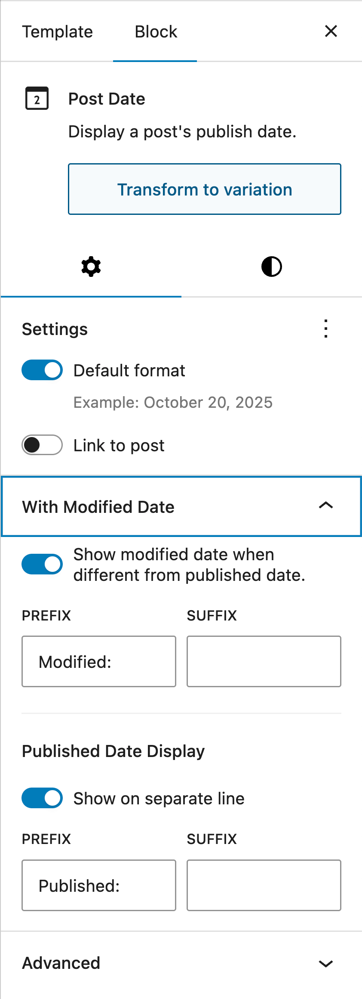
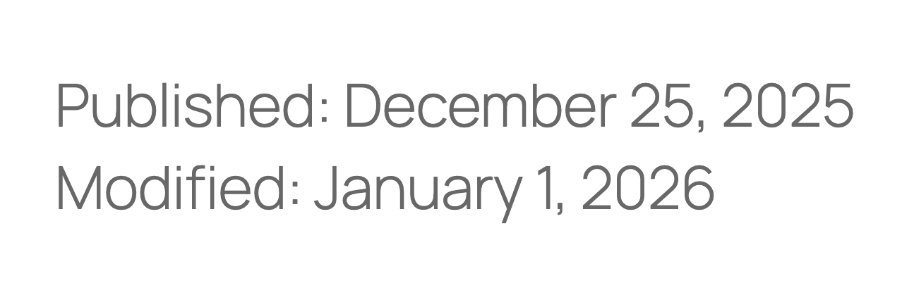
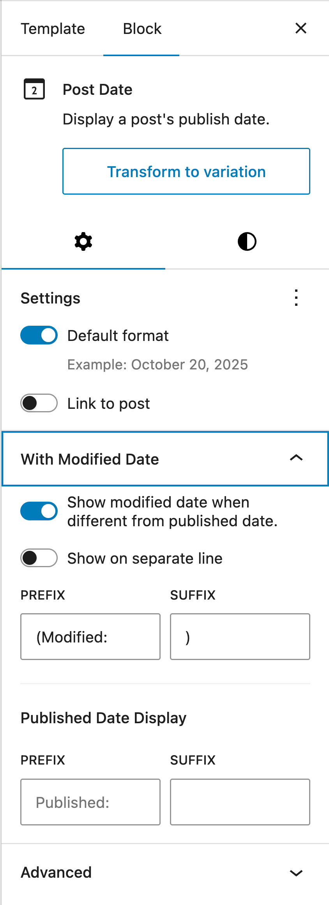

# Post Date Block: Published & Modified

<!-- markdownlint-disable-next-line no-inline-html -->

Appends the modified date to the Post Date block when different from the published date.

**Contributors:** [westonruter](https://profile.wordpress.org/westonruter)  
**Tags:**         block, date, site editor, gutenberg, block templates  
**Tested up to:** 6.9  
**Stable tag:**   1.0.0  
**License:**      [GPLv2 or later](https://www.gnu.org/licenses/old-licenses/gpl-2.0.html)

## Description

This plugin extends the Date block in core, specifically the "Post Date" variation of the Date block. When the modified date is different from the published date in the current date format, this extension allows the modified date to be appended to the end of the block. This allows the published date and the modified date to both be displayed in the same block. Settings are provided to add prefixes and suffixes for both the published date and the modified date when both are displayed. There is also a setting to display the modified date on a separate line.

This is a prototype or stopgap for [gutenberg#53099](https://github.com/WordPress/gutenberg/issues/53099) (Post date: It is not clear that "display modified date" replaces the publishing date). See also [gutenberg#61920](https://github.com/WordPress/gutenberg/pull/61920) (Add prefix / suffix to Post Date block). What eventually lands in core will hopefully leverage “[shortblocks](https://github.com/WordPress/gutenberg/issues/73929)” so that the conditional prefixes and suffixes needn't be provided in a block settings panel.

To use:

1. Open the Site Editor to edit a block template.
2. Insert a Date block.
3. In the block settings, click the “Transform to variation” button and select “Post Date”.
4. A new “With Modified Date” panel appears in the settings. Enable the “Show modified date when different from published date” toggle.
5. Configure the prefixes and suffixes for the published date and modified date when the two differ for the selected date format; also consider the toggle to show the published date on a separate line.

## Installation

_Notice: Not yet available on WordPress.org._

### Automatic

1. ~Visit **Plugins > Add New** in the WordPress Admin.~
2. ~Search for **Post Date Block: Published & Modified**.~
3. ~Install and activate the **Post Date Block: Published & Modified** plugin.~

You may also install and update via [Git Updater](https://git-updater.com/) using the [plugin's GitHub URL](https://github.com/westonruter/post-date-modified).

### Manual

1. Download the plugin ZIP ~either [from WordPress.org](https://downloads.wordpress.org/plugin/post-date-modified.zip) or~ [from GitHub](https://github.com/westonruter/post-date-modified/archive/refs/heads/main.zip). Alternatively, if you have a local clone of the repo, run `npm run plugin-zip`.
2. Visit **Plugins > Add New Plugin** in the WordPress Admin.
3. Click **Upload Plugin**.
4. Select the `post-date-modified.zip` file on your system from step 1 and click **Install Now**.
5. Click the **Activate Plugin** button.

## Screenshots

### Settings for prefix on published date and modified date

### Frontend rendering of prefix on published date and modified date (when they differ)

### Settings for prefix and suffix on modified date only with line break removed

### Frontend rendering for prefix and suffix on modified date only with line break removed

## Changelog

### 1.0.0

* Initial release.
